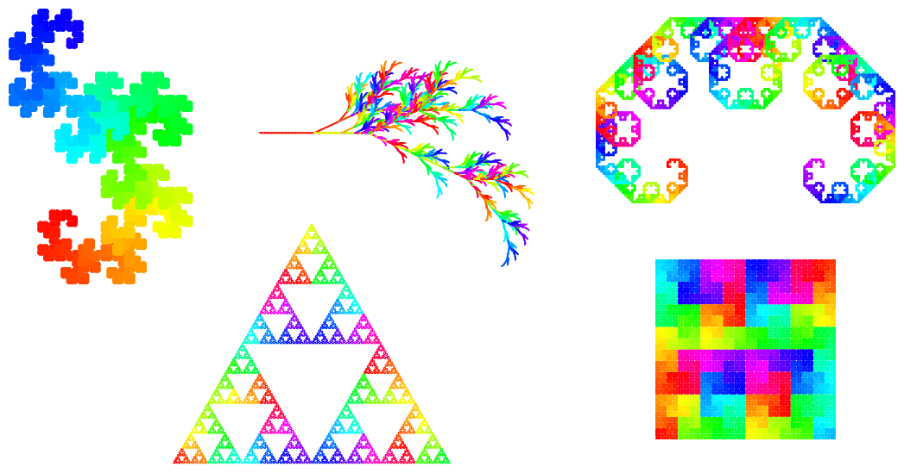

# lsystem-generator

A Python script for generating fractal-like structures using [L-systems](https://en.wikipedia.org/wiki/L-system). Preset patterns can be generated, or random fractals can be generated. Outputs can be set as a wallpaper in Windows: by calling this script through Task Scheduler, random desktop wallpapers can be generated periodically or upon specific events (like logging in).Inkscape is required for this script to operate on SVG images.



For available command line arguments, run
```
python wallpaper.py --help
```

Usage:
```
python wallpaper.py [-h] [-t {sierpinski,dragon,plant,sierpinski_approx,hilbert,levy,rand,alldemo}] [-f FILENAME] [-r RAND_FILE_PREFIX] [-n RAND_GENERATE_MULTI] [-w] [-v]

options:
  -h, --help            show this help message and exit
  -t {sierpinski,dragon,plant,sierpinski_approx,hilbert,levy,rand,alldemo}, --type 
  -f FILENAME, --filename FILENAME
  -r RAND_FILE_PREFIX, --rand_file_prefix RAND_FILE_PREFIX
  -n RAND_GENERATE_MULTI, --rand_generate_multi RAND_GENERATE_MULTI
  -w, --set_wallpaper
  -v, --verbose
```
